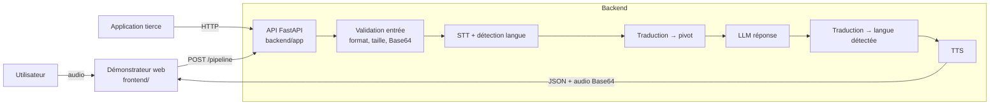

# 02 — Architecture

## 1. Vue d'ensemble

Architecture **modulaire** (exigence §8) : données, modèles, API et démonstrateur sont séparés et
communiquent par des **contrats explicites**.



## 2. Arborescence

```
newprojet/
├── backend/            # API REST (pôle Backend — M7)
│   ├── app/
│   │   ├── main.py         # création de l'application, montage des routeurs
│   │   ├── config.py       # configuration via variables d'environnement
│   │   ├── audio.py        # lecture multipart/Base64 + validation audio
│   │   ├── errors.py       # format d'erreur unique
│   │   ├── schemas.py      # contrats de requêtes/réponses (→ /docs)
│   │   ├── routers/        # un fichier par endpoint
│   │   └── services/
│   │       ├── base.py     # ★ INTERFACES des briques IA (contrat backend ↔ IA)
│   │       ├── mock.py     # implémentations factices
│   │       └── registry.py # choix du moteur selon LANGCI_ENGINE
│   └── tests/
├── ml/                 # Outils data & modèles (pôles Data et IA — M1..M5)
│   ├── dataset.py          # validation des métadonnées + découpage train/val/test
│   ├── metrics.py          # WER, CER, exactitude, F1
│   ├── notebooks/          # exploration, baselines, entraînement
│   └── tests/
├── data/               # Corpus (audio hors Git) — voir data/README.md
├── frontend/           # Démonstrateur web (pôle Frontend — M6)
└── docs/               # Cadrage, architecture, API, données, ML, organisation, ADR
```

## 3. Le principe clé : interfaces + moteurs interchangeables

`backend/app/services/base.py` définit **4 interfaces** :

| Interface | Méthode | Pôle responsable |
|-----------|---------|------------------|
| `SpeechRecognizer` | `transcribe(audio) → Transcription(text, language, confidence)` | M4 (STT) |
| `Translator` | `translate(text, source, target) → str` | M3 / M4 |
| `Responder` | `answer(question, language) → str` | M3 (LLM) |
| `SpeechSynthesizer` | `synthesize(text, language, voice_id) → bytes WAV` | M5 (TTS) |

Les endpoints ne connaissent **que** ces interfaces. Conséquences :

1. **Travail en parallèle dès le jour 1** : le backend et le frontend avancent avec le moteur `mock`
   pendant que les équipes IA préparent les modèles.
2. **Intégration sans risque** : un vrai modèle = une nouvelle classe qui implémente l'interface,
   enregistrée dans `registry.py`. Aucun endpoint à modifier.
3. **Comparaison de modèles** : on change `LANGCI_ENGINE` pour basculer d'un moteur à l'autre.

Voir [ADR 0001](adr/0001-interfaces-et-moteur-mock.md).

## 4. Choix techniques

| Domaine | Choix | Justification |
|---------|-------|---------------|
| API | FastAPI + Pydantic | Imposé par le cahier (§8) ; documentation OpenAPI `/docs` automatique |
| Configuration | pydantic-settings + `.env` | Secrets hors du code (exigence §12) |
| Données | CSV de métadonnées + fichiers audio | « Fichiers structurés au début » (§8) ; PostgreSQL seulement si besoin avéré |
| Traitement audio | librosa, soundfile | Standard Python pour l'audio |
| Qualité | pytest, ruff, CI GitHub Actions | Code versionné et vérifié automatiquement (§12) |
| Démonstrateur | HTML/CSS/JS sans framework | Suffisant pour une démo, zéro build, servi par l'API sur `/demo/` |

## 5. Points d'attention

- **Chargement des modèles** : les vrais modèles devront être chargés **une seule fois** au
  démarrage (dans `build_engines`), jamais à chaque requête.
- **Temps de calcul** : les appels aux modèles sont exécutés dans un pool de threads
  (`run_in_threadpool`) pour ne pas bloquer le serveur.
- **Audio navigateur** : les navigateurs enregistrent en WebM/Ogg ; le démonstrateur convertit en
  WAV 16 kHz mono avant l'envoi (l'API n'accepte que WAV/MP3).
